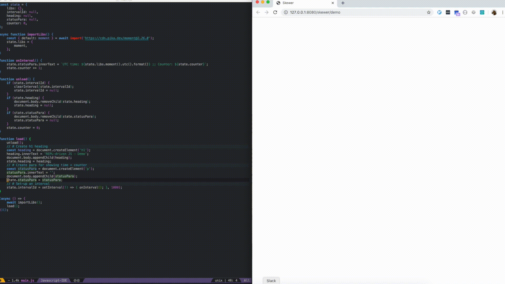

# repl-driven-js

_⚠️ This is a work in progress - I'm experimenting with it currently to see how it works for a bigger project ⚠️_

Demonstration of doing REPL-driven development on the web with JS using Spacemacs

## Summary



## What is this?

REPL-driven development is a kind of highly interactive development flow that comes from Lisp. [Stuart Halloway has a great video explaining its benefits](https://vimeo.com/223309989).

In JavaScript, there are two popular methods for interactive development:

- **Live Reload**: Page is reloaded whenever JS changes are saved. [budo](https://github.com/mattdesl/budo) is a great example of this.
  - ✅ This is fine. For simple web apps, they're generally fully reloaded before you even switch from the editor to the browser.
  - ❌ Unfortunately, any existing state in the app gets wiped on reload. For many apps, this is fine, but it is not ideal for games or other long-running flows.
- **Hot Module Replacement** ([Webpack's guide](https://webpack.js.org/guides/hot-module-replacement/)): Individual modules are reloaded without stopping the app.
  - 👌🏼 This is higly interactive, an app can be played with to get into a certain state and then tweak the code and see the results with no page refresh.
  - ❌ Webpack is required for this to work. Debugging bundled code is generally more difficult than native code, which can easily be directly debugged with the browser.
  - ❌ How useful this is depends on how you modularise your code. If everything is in one module, for example, this is equivalent to the Live Reload method, with state being wiped on each change. For this reason, manual page refreshes are required from time to time.

REPL-driven development is an even more highly interactive approach that has an answer to each of the above problems, though it does require a purposeful design to get it to work best.

To be fair, here are the pros/cons with REPL-driven Development for JS:

- 👌🏼👌🏼👌🏼 Very highly interactive. Functions, state, dependencies, etc can be modified indefinitely without requiring a manual page refresh.
- 👌🏼 Works without needing to bundle JS, which improves the use of tooling e.g. browser debugger.
- ❌ To work well, this requires an IDE that supports evaluating JavaScript into a live window. As far as I know, this is only available for Emacs.
- ❌ I lied earlier. It is sometimes easier to do a manual page refresh if you've ended up in a funky state. This is aviodable but it's not hard to make mistakes.
- ❌ In order to maximise REPL-driven-ability, code can become rather non-traditional for JS e.g. keeping imports in an object.

Especially for the last reason, I would recommend only using REPL-driven development if you know that it will be more productive for your goal. A small group of people making a WebGL game is a very good example of a development flow that would be greatly improved.

## Set-up

You'll need a modern browser as this approach only works with modern ES features (e.g. `import()`).

1. [Install Spacemacs](https://www.spacemacs.org/).
2. In Spacemacs, [install the `javascript` layer](https://github.com/syl20bnr/spacemacs/blob/master/doc/BEGINNERS_TUTORIAL.org#adding-language-support-and-other-features-using-layers).

## First application

1. Create a JS file in Spacemacs and enter the following code:
    ```js
    console.log('Hey Giiirrrrrrl!');
    ```
2. Run `SPC m '` to run a **skewer** REPL. skewer is the emacs plugin that allows live web development. This will launch a browser window that Spacemacs is connected to.
3. Run `SPC m s b` to evaluate the whole buffer. This will log `Hey Giiirrrrrrl!` to the console in your browser window.
4. Now, we can try something a little more complicated. Change your JS file's contents to:
    ```js
    function load() {
      // # Create h1 heading
      const heading = document.createElement('h1');
      heading.innerText = 'REPL-driven JS - Demo';
      document.body.appendChild(heading);
      // # Create paragraph for showing time + counter
      const statusPara = document.createElement('p');
      statusPara.innerText = '';
      document.body.appendChild(statusPara);
      // # Set-up an interval
      let counter = 0;
      setInterval(() => {
        statusPara.innerText = `Counter: ${counter}`;
        counter += 1;
      }, 1000);
    }

    load();
    ```
5. Evaluate this (again: `SPC m s b`), and you will see that the DOM elements and timer have been created.

## Problem 1: Every Time I Re-evaluate, Things gets Duplicated!

_TODO_

- Demonstrate: By calling `load()` (without state checking logic twice and showing that DOM elements, timers, etc get duplicated)
- Solution: Use `state` and `unload()` function

## Problem 2: Re-evaluating the onInterval() Function does not Affect the Existing Interval!

_TODO_

- Demonstrate: `setInterval(onInterval, 1000);`. This causes the issue
- Solution: `setInterval(() => { onInterval(); }, 1000);` _TODO: intuitively, this makes sense, but I don't know the exact reason_

## Problem 3: How to Import External Libraries?

We can't use CommonJS `require()` as that isn't supported on the web.

We can't use static `import .. from ..` declarations. These cannot be used in a REPL.

So, let's use [Dynamic imports](https://developer.mozilla.org/en-US/docs/Web/JavaScript/Reference/Statements/import#Dynamic_Imports). This is a native import that can be used anywhere in a program's flow. It loads the module asynchronously, returning it in a `Promise`.

Because this is dynamic, it means we can update our code's dependencies while the app is still running.

This looks like:

```js
async function importLibs() {
  const { default: moment } = await import('https://cdn.pika.dev/moment@2.26.0');
  state.libs = {
    moment,
  };
}
```

If we want to add another dependency, we can easily add it to this function e.g.:

```js
async function importLibs() {
  const { default: moment } = await import('https://cdn.pika.dev/moment@2.26.0');
  const { default: regl } = await import('https://cdn.pika.dev/regl@1.5.0'); // <-- new line
  state.libs = {
    moment,
  };
}
```

Re-evaluate the `importLibs()` function with `SPC m s r` and the new dependencies will immediately become available to your running app.

## But don't run this code in Prod!

_TODO_

## skewer-mode issues

If skewer-mode does not work for you, you might be experiencing this issue: https://github.com/skeeto/skewer-mode/issues/18

This happened to me. There must have been some package conflict issue with existing packages. I fixed it by doing a clean re-install of Spacemacs:

```sh
# Backup Emacs / Spacemacs
mv .emacs .emacs.backup
mv .spacemacs .spacemacs.backup
# Re-install (https://www.spacemacs.org/#)
git clone https://github.com/syl20bnr/spacemacs ~/.emacs.d
```

